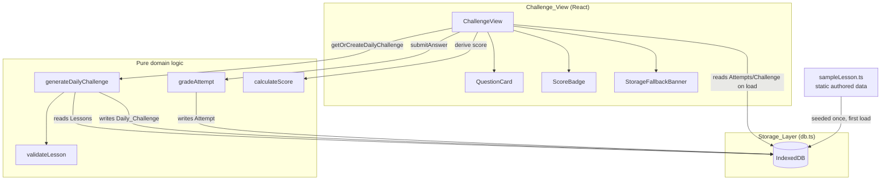
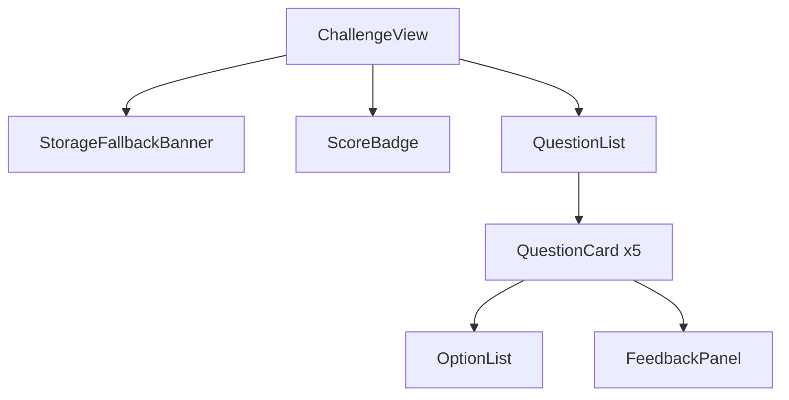
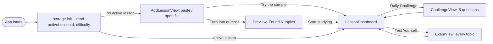

# Design Document

## Overview

Studyy is a client-side-only single-page app. There is no backend, no auth, no network dependency for core functionality. All state (lessons, generated daily challenges, and attempts) lives in the browser via IndexedDB, accessed exclusively through a `Storage_Layer` module.

Phase 1 scope, matching requirements.md:
- Validate and store `Lesson` content structured as 4 `Lesson_Section`s of `Concept`s.
- Ship one bundled `Sample_Lesson` so the app works with zero configuration.
- Generate a deterministic, stable-per-day `Daily_Challenge` of 5 `Question`s from a lesson's concepts.
- Grade submissions instantly and trace every correct answer back to its source lesson text.
- Score attempts with a pure, deterministic `Scoring_Engine` using a first-attempt-only rule, clamped to 0-100.
- Persist everything locally, degrading gracefully to in-memory operation when IndexedDB is unavailable.

Question content for Phase 1 is **static and authored by hand** inside the Sample_Lesson data file — there is no question-generation API, no LLM call, and no network request anywhere in the app. "Generation" in this design refers only to the deterministic *selection and assembly* of 5 questions from a lesson's pre-authored concept pool (Requirement 3), not to creating new question content at runtime.

## Tech Stack

| Concern | Choice | Why |
|---|---|---|
| Language | TypeScript | Type-safety for the data model (Lesson/Question/Attempt shapes) catches structural mistakes at compile time, which matters a lot given how strict the EARS acceptance criteria are about shape (section-count bounds, option counts per difficulty, etc.). |
| Build tool | Vite | Fast dev server and build, zero-config for a small SPA, minimal setup time — appropriate for a hackathon-scoped submission. |
| UI framework | React 18 (function components + hooks) | Most conventional choice for a small SPA; huge ecosystem, easy to reason about component state (current question index, selected option, grading result) with `useState`/`useReducer`. No routing library needed — this is effectively a single view. |
| IndexedDB access | Hand-written thin wrapper (`db.ts`) around the native `indexedDB` API, using small `promisify` helpers internally (no external runtime dependency) | Steering (`storage.md`) requires a dedicated data-access layer as the *only* IndexedDB touchpoint. Keeping it dependency-free avoids adding a library just to wrap ~5 object stores worth of CRUD, and keeps the bundle small. |
| Testing | Vitest (unit) + `fast-check` (property-based testing) + `fake-indexeddb` (in-memory IndexedDB for tests) | Vitest is the natural pairing with Vite (shared config/transform pipeline). `fast-check` is the standard PBT library for TypeScript/JavaScript. `fake-indexeddb` lets Storage_Layer property tests run in Node without a real browser. |

No state-management library, no CSS framework, no router — the app is one view with a handful of sub-components, so extra machinery would add complexity without benefit.

## Architecture



Layering rules:
- **UI layer** (React components) never touches IndexedDB directly. It calls into the domain layer and the Storage_Layer's public API only.
- **Domain layer** (`generateDailyChallenge`, `gradeAttempt`, `calculateScore`, `validateLesson`) is pure where the requirements demand purity (scoring, grading, validation). `generateDailyChallenge` is the one domain function permitted to call the Storage_Layer, because "get-or-create for today" is inherently stateful (Req 3.5) — its *question-selection* sub-routine, however, is a pure helper that is separately unit/property tested.
- **Storage_Layer** (`db.ts`) is the sole module that imports `indexedDB`. Every other module reaches persisted data through it.

## Components and Interfaces

### Storage_Layer (`src/storage/db.ts`)

Sole IndexedDB access point (steering: `storage.md`). Exposes a small typed, promise-based API; internally manages connection, schema versioning, and error translation.

```ts
export interface StorageLayer {
  init(): Promise<void>; // opens/upgrades the DB, seeds Sample_Lesson if absent

  getLesson(id: string): Promise<Lesson | undefined>;
  putLesson(lesson: Lesson): Promise<void>;
  listLessons(): Promise<Lesson[]>;

  getDailyChallenge(dateKey: string): Promise<DailyChallenge | undefined>;
  putDailyChallenge(challenge: DailyChallenge): Promise<void>;

  getAttempts(dateKey: string): Promise<Attempt[]>;
  putAttempt(attempt: Attempt): Promise<void>;
}

export type StorageStatus =
  | { kind: "ok" }
  | { kind: "degraded"; reason: "unsupported" | "blocked" | "quota-exceeded"; message: string };

export function getStorageStatus(): StorageStatus;
```

**Schema (IndexedDB database `daily-challenge-db`, version 1):**

| Object store | Key path | Indexes |
|---|---|---|
| `lessons` | `id` | none needed at Phase 1 scale |
| `dailyChallenges` | `dateKey` (e.g. `"2025-01-15"`) | none |
| `attempts` | `id` (composite `${dateKey}:${questionId}:${submittedAt}`) | `by_dateKey` on `dateKey`, `by_question` on `[dateKey, questionId]` |

Versioning: schema changes go through `onupgradeneeded`. Each bump is documented as a code comment above the `upgrade` switch, e.g.:

```ts
// v1 (2025-01): initial stores — lessons, dailyChallenges, attempts
request.onupgradeneeded = (event) => {
  const db = request.result;
  const oldVersion = event.oldVersion;
  if (oldVersion < 1) {
    db.createObjectStore("lessons", { keyPath: "id" });
    db.createObjectStore("dailyChallenges", { keyPath: "dateKey" });
    const attempts = db.createObjectStore("attempts", { keyPath: "id" });
    attempts.createIndex("by_dateKey", "dateKey");
    attempts.createIndex("by_question", ["dateKey", "questionId"]);
  }
  // v2+ upgrades appended here, guarded by `if (oldVersion < N)`
};
```

**Error handling / fallback (Req 9.3, 9.4):**
- `init()` wraps `indexedDB.open` in a promise that resolves `StorageStatus`. `onerror`/`onblocked` and a feature-detection check (`typeof indexedDB === "undefined"`) map to `degraded` with a specific `reason`.
- On `degraded`, the Storage_Layer swaps its internal implementation for an **in-memory adapter** (same `StorageLayer` interface, backed by a `Map`) so callers above it are unaffected — they always get a working `StorageLayer`, just non-persistent.
- Any already-persisted records written before the failure remain in IndexedDB untouched; the in-memory adapter starts empty for the rest of the session (Req 9.3's "retain already-persisted data" is satisfied because the fallback never deletes/rewrites existing stores — it just stops attempting further IndexedDB writes).
- The UI subscribes to storage status via `getStorageStatus()` and renders `StorageFallbackBanner` (a dismissible, `role="status"` banner) whenever status is `degraded`.

### Sample_Lesson (`src/data/sampleLesson.ts`)

A single statically authored, exported `Lesson` object, bundled into the app at build time (plain TS module, no fetch):

```ts
export const SAMPLE_LESSON: Lesson = {
  id: "sample-lesson",
  title: "…",
  sections: [ /* 4 Lesson_Section objects (one per topic), hand-authored */ ],
};
```

- `StorageLayer.init()` calls `listLessons()`; if no lesson in storage satisfies `validateLesson()` other than `SAMPLE_LESSON` itself, it `putLesson(SAMPLE_LESSON)` once (idempotent — re-running `init` does not duplicate it since `id` is the key).
- Because it's a module-level constant compiled into the bundle, it is available on first load with no download, no file picker, no config (Req 2.1) and involves zero network requests (Req 2.2).

### Domain: `validateLesson` (`src/domain/lesson.ts`)

```ts
export interface LessonValidationResult {
  valid: boolean;
  errors: string[]; // e.g. "expected 1-12 sections, got 0"
}
export function validateLesson(lesson: Lesson): LessonValidationResult;
```

Checks, in order: 1-12 sections (one per topic, Phase 2); each section's trimmed title (1-100 chars), trimmed explanation (1-2000 chars), and concept count (1-20). Returns all violations, not just the first, so callers can surface a full rejection reason (Req 1.4/1.5).

### Domain: `selectActiveLesson` (`src/domain/lesson.ts`)

```ts
export function selectActiveLesson(storedLessons: Lesson[]): Lesson;
```
Returns the first stored lesson (excluding the sample) that passes `validateLesson`; falls back to `SAMPLE_LESSON` if none qualifies (Req 2.3). Phase 1 ships only the sample lesson in practice, but this keeps the selection rule explicit and testable ahead of a future "custom lesson" feature.

### Domain: `generateDailyChallenge` (`src/domain/challenge.ts`)

```ts
export function getOrCreateDailyChallenge(
  dateKey: string,
  lesson: Lesson,
  storage: StorageLayer
): Promise<DailyChallenge>;

// pure helper, independently testable
export function selectQuestions(
  lesson: Lesson,
  seed: string, // derived from dateKey + lesson.id, makes selection deterministic
  count: number // 5
): Question[];
```

`getOrCreateDailyChallenge`:
1. `storage.getDailyChallenge(dateKey)` — if present, return it unchanged (Req 3.5).
2. Otherwise call the pure `selectQuestions(lesson, seed, 5)`, wrap in a `DailyChallenge`, `storage.putDailyChallenge(...)`, and return it.

`selectQuestions` (pure, deterministic given the same `seed`):
1. Flatten all `Concept`s across the lesson's sections into one ordered pool, each tagged with its owning `sectionId`.
2. Filter out concepts that cannot produce a valid question (Req 5.4): a concept must have a non-empty explanation-or-quote source and a derivable `sourceQuote` that is an exact substring of its section's `explanation` or the concept's own text.
3. Deterministically shuffle the filtered pool using a seeded PRNG (seed = `dateKey + ":" + lesson.id`) — same seed always yields the same order, so regeneration is reproducible without needing storage (defense in depth for Req 3.5, though storage already short-circuits re-generation).
4. If pool size >= 5: take the first 5 distinct concepts (Req 3.2).
   If pool size < 5 (and >= 1, guaranteed by `validateLesson`): cycle through the shuffled pool, reusing concepts in round-robin order, until exactly 5 questions are produced (Req 3.6).
5. For each chosen concept, build a `Question`: the concept's fact becomes the `Correct_Option`; 3 distractor `Answer_Option`s are deterministically drawn (same seeded PRNG) from *other* concepts' short facts in the lesson (falling back to lesson-wide distractor pool if the section is small); all 4 options are shuffled into a seeded order; `sourceQuote` and `explanation` are attached from the concept/section text; `sectionId` records the originating section (Req 5.3).

Determinism note: "seeded PRNG" here is a small deterministic hash-based generator (e.g. mulberry32 seeded from a string hash) — no `Math.random()` is used in generation, which is what makes Req 3.5 (stable reload) hold even before the `getOrCreateDailyChallenge` storage short-circuit is considered.

**Calendar day determination:** `dateKey` is computed once, at the point the Challenge_View mounts and whenever the app regains focus, as `formatLocalDate(new Date())` → `"YYYY-MM-DD"` using the device's local timezone (`Date.getFullYear/getMonth/getDate`, not UTC), matching Req 9.5's "as determined by the device's local date."

### Grading_Engine (`src/domain/grading.ts`)

```ts
export interface GradeResult {
  isCorrect: boolean;
  correctOptionId: string;
  explanation: string;
  sourceQuote: string;
}

export function gradeAttempt(question: Question, submittedOptionId: string): GradeResult;

export type SubmitAnswerError = { kind: "invalid-option" } | { kind: "already-answered"; prior: GradeResult };

export function submitAnswer(
  question: Question,
  submittedOptionId: string | undefined,
  priorAttempt: Attempt | undefined
): { ok: true; result: GradeResult; attempt: Attempt } | { ok: false; error: SubmitAnswerError };
```

- `gradeAttempt` is pure and synchronous: given any of the question's 4 `optionId`s, it returns `isCorrect`, the `correctOptionId` (always, win or lose — Req 4.2), and the correct option's `explanation`/`sourceQuote` (Req 5.1/5.2).
- `submitAnswer` is the orchestration wrapper the UI calls: it rejects `undefined`/blank or unrecognized option ids without grading or recording anything (Req 4.4); it rejects a second submission for a question that already has a same-day `Attempt`, instead returning the previously computed result so the UI can redisplay it unchanged (Req 4.3); otherwise it grades, builds an `Attempt` (with a `submittedAt` timestamp for chronological ordering), and returns it for the caller to persist via `storage.putAttempt`.

### Scoring_Engine (`src/domain/scoring.ts`)

```ts
export function calculateScore(
  challenge: DailyChallenge,
  attempts: readonly Attempt[]
): number; // integer 0-100
```

Pure function, no I/O, does not mutate `attempts` (Req 6.2). Algorithm:
1. Filter `attempts` to only those whose `dateKey === challenge.dateKey` and whose `questionId` is one of `challenge.questions[].id` (Req 6.3).
2. Group the filtered attempts by `questionId`; within each group, pick the one with the earliest `submittedAt` (ties broken by a stable input-order tiebreaker so the result stays deterministic regardless of array order) — this is the "first recorded Attempt" (Req 7.1/7.2).
3. Count how many of those first-attempts have `selectedOptionId === question.correctOptionId` (Req 7.3).
4. `score = round(correctCount / challenge.questions.length * 100)`, then `clamp(score, 0, 100)` (Req 6.1, 8.1).

Because step 2's grouping/min-by-timestamp and step 4's arithmetic don't depend on array order, the same attempt *set* always yields the same score regardless of order (Req 6.1).

### UI: Challenge_View (`src/ui/ChallengeView.tsx` + children)

Mobile-first, single-column layout; semantic HTML; all interactive controls keyboard-operable (native `<button>`/`<input type=radio>`, visible `:focus-visible` styles) per `ui.md`.



- **`ChallengeView`**: on mount, resolves `dateKey`, loads/creates the day's `DailyChallenge` and its `Attempts` via the domain+storage layers, holds them in React state, and re-renders on every `submitAnswer`.
- **`QuestionCard`**: renders one `Question`'s prompt and its 4 `Answer_Option`s as a `<fieldset>` with a `<legend>` (question text) and radio `<input>`s; a submit `<button>`. Once answered (from state or a restored `Attempt`), options become disabled/read-only and `FeedbackPanel` renders.
- **`FeedbackPanel`**: shows correct/incorrect status (`aria-live="polite"` region so screen readers announce it), highlights the `Correct_Option`, and displays `explanation` + `sourceQuote` (Req 4.2, 5.1, 5.2).
- **`ScoreBadge`**: 
  - If `attempts.length === 0` for the day → renders the literal text **"Not assessed yet"** (Req 8.2).
  - Else → renders the numeric result of `calculateScore(challenge, attempts)` as `"{n}%"`, recomputed on every attempt change so it always reflects the latest state (Req 8.3).
- **`StorageFallbackBanner`**: renders only when `getStorageStatus().kind === "degraded"`; dismissible (`aria-live="assertive"` on first appearance), explains data won't persist this session (Req 9.3/9.4).

## Data Models

```ts
export interface Concept {
  id: string;
  text: string;          // the fact/idea itself
  explanation: string;    // >0 chars when usable for a question
  sourceQuote: string;    // exact substring of `text` or the parent section's explanation
}

export interface LessonSection {
  id: string;
  title: string;          // trimmed, 1-100 chars
  explanation: string;    // trimmed, 1-2000 chars
  concepts: Concept[];    // 1-20 items
}

export interface Lesson {
  id: string;
  title: string;
  sections: LessonSection[]; // 1-12 (one per topic), order = authored order
}

export interface AnswerOption {
  id: string;
  text: string;
}

export interface Question {
  id: string;
  sectionId: string;         // the one LessonSection this question traces back to
  conceptId: string;
  prompt: string;
  options: AnswerOption[];   // 4 (Normal/Hard) or 3 (Easy)
  correctOptionId: string;   // one of options[].id
  explanation: string;       // non-empty
  sourceQuote: string;       // non-empty, exact substring of section content
}

export interface DailyChallenge {
  dateKey: string;      // "YYYY-MM-DD", local date
  lessonId: string;
  questions: Question[]; // exactly 5, fixed order once created
}

export interface Attempt {
  id: string;            // `${dateKey}:${questionId}:${submittedAt}`
  dateKey: string;
  questionId: string;
  selectedOptionId: string;
  isCorrect: boolean;
  submittedAt: number;   // epoch ms, used for first-attempt chronological ordering
}
```

This maps directly onto the requirements Glossary: `Lesson` → `LessonSection` → `Concept`, `Question` → `AnswerOption`/`correctOptionId`, `DailyChallenge` holding exactly 5 `Question`s, and `Attempt` as the recorded submission unit that `Scoring_Engine` consumes.

## Correctness Properties

*A property is a characteristic or behavior that should hold true across all valid executions of a system—essentially, a formal statement about what the system should do. Properties serve as the bridge between human-readable specifications and machine-verifiable correctness guarantees.*

### Property 1: Lesson section-count validity

For any Lesson with an arbitrary number of sections, `validateLesson` reports the lesson valid with respect to section count if and only if it has 1-12 sections, and reports it invalid (with a section-count error) otherwise.

**Validates: Requirements 1.1, 1.4**

### Property 2: Lesson section field validity

For any Lesson_Section with an arbitrary (including empty, whitespace-only, boundary-length, and over-length) title and explanation, and an arbitrary (including zero, boundary, and over-limit) number of concepts, `validateLesson` reports the containing lesson valid with respect to that section if and only if the section's trimmed title is 1-100 characters, its trimmed explanation is 1-2000 characters, and it has 1-20 concepts; otherwise it reports the lesson invalid with a corresponding error for that section.

**Validates: Requirements 1.2, 1.5**

### Property 3: Section order is preserved on load

For any Lesson authored with its sections in a given order, loading that lesson (round-trip through construction/parsing) returns its sections in that same order.

**Validates: Requirements 1.3**

### Property 4: Active lesson selection falls back to the Sample_Lesson

For any set of stored lessons (including the empty set, sets containing only invalid lessons, and sets containing at least one valid non-sample lesson), `selectActiveLesson` returns the Sample_Lesson if and only if no stored lesson other than the Sample_Lesson satisfies `validateLesson`; otherwise it returns a lesson that does satisfy `validateLesson`.

**Validates: Requirements 2.3**

### Property 5: Generated Daily_Challenge has the required shape

For any valid Lesson, `selectQuestions` (via `getOrCreateDailyChallenge`) produces exactly 5 questions, each with exactly 4 answer options at the default Normal difficulty (3 at Easy), each with exactly one option marked as the correct option.

**Validates: Requirements 3.1, 3.3, 3.4**

### Property 6: Concept usage respects distinctness and reuse rules

For any valid Lesson with N usable concepts, the 5 generated questions reference distinct concepts drawn from that lesson if N >= 5, and reuse concepts from the lesson's usable pool as needed to still produce exactly 5 questions if 1 <= N < 5.

**Validates: Requirements 3.2, 3.6**

### Property 7: Reopening the Challenge_View is idempotent

For any valid Lesson and calendar day, calling `getOrCreateDailyChallenge` twice in succession for that day and lesson returns deep-equal Daily_Challenge results both times (same question order, same options per question, same option order, same correct-option designation).

**Validates: Requirements 3.5**

### Property 8: Grading is synchronous and reports correctness against the true correct option

For any generated Question and any of its option ids submitted, `gradeAttempt` returns synchronously (no pending promise) with `isCorrect` equal to `(submittedOptionId === question.correctOptionId)` and `correctOptionId` always equal to the question's correct option id, regardless of which option was submitted.

**Validates: Requirements 4.1, 4.2**

### Property 9: An answered Question rejects further submissions

For any Question that already has a recorded same-day Attempt, calling `submitAnswer` again for that question returns the previously computed grade result unchanged, does not record a new Attempt, and does not modify the existing Attempt.

**Validates: Requirements 4.3**

### Property 10: Every generated Question is traceable to its source

For any generated Question, its `explanation` is non-empty, its `sourceQuote` is non-empty, its `sourceQuote` is an exact substring of its originating `LessonSection`'s explanation or of one of that section's concepts' text, and its `sectionId` identifies exactly that originating section. Concepts lacking a derivable explanation or source quote are never selected into a Daily_Challenge.

**Validates: Requirements 5.1, 5.2, 5.3, 5.4**

### Property 11: Score reflects only first, in-scope attempts, order-independently

For any Daily_Challenge and any set of Attempts (including attempts for other dates, attempts for questions outside the challenge, and multiple attempts per question with varying timestamps and array order), `calculateScore` counts, for each in-scope question, only its chronologically-first same-day attempt, credits the score only when that first attempt's selected option is the question's correct option, and returns the same result regardless of the order in which the attempts array is provided.

**Validates: Requirements 6.1, 6.3, 7.1, 7.2, 7.3**

### Property 12: Scoring is pure

For any Daily_Challenge and any Attempts array, calling `calculateScore` does not mutate the Attempts array (verified by deep-equality before and after the call) and does not invoke the Storage_Layer or any network function.

**Validates: Requirements 6.2**

### Property 13: Score is always clamped to 0-100

For any Daily_Challenge and any Attempts array, including malformed or adversarial combinations, `calculateScore` returns an integer between 0 and 100 inclusive.

**Validates: Requirements 8.1**

### Property 14: Displayed score matches the pure calculation

For any Daily_Challenge and any non-empty Attempts array for that day, the score rendered by `ScoreBadge` equals `calculateScore(challenge, attempts)`.

**Validates: Requirements 8.3**

### Property 15: Storage round-trips a Daily_Challenge and its Attempts

For any randomly generated Daily_Challenge and set of Attempts written for a given dateKey through the Storage_Layer, reading them back for that same dateKey (as on a same-day reload) reproduces data deep-equal to what was written.

**Validates: Requirements 9.5**

## Error Handling

| Failure | Where handled | Behavior |
|---|---|---|
| Lesson fails structural validation | `validateLesson` at load/seed time | Lesson is rejected with a list of reasons; never used as an active lesson or challenge source (Req 1.4/1.5). |
| No non-sample lesson is valid | `selectActiveLesson` | Falls back to `SAMPLE_LESSON` (Req 2.3). |
| Invalid/missing submitted option | `submitAnswer` | Returns `{ ok: false, error: { kind: "invalid-option" } }`; no Attempt recorded; `QuestionCard` shows an inline error message tied to the option list via `aria-describedby` (Req 4.4). |
| Duplicate submission for an answered question | `submitAnswer` | Returns `{ ok: false, error: { kind: "already-answered", prior } }`; UI re-renders the prior `FeedbackPanel` instead of accepting new input (Req 4.3). |
| IndexedDB unsupported / blocked / quota exceeded | `Storage_Layer.init()` / any write | `StorageStatus` flips to `degraded` with a `reason`; layer swaps to an in-memory adapter transparently; `StorageFallbackBanner` renders and stays visible until dismissed or the next successful init; already-persisted data is left untouched, and the current session continues fully functional in-memory (Req 9.3, 9.4). |
| Storage read on load finds no challenge for today | `getOrCreateDailyChallenge` | Not an error — this is the normal "new day" path; a fresh challenge is generated and persisted. |

No error state in this app is fatal to the current session: every failure path above still leaves the user able to complete the day's Daily_Challenge, per Req 9.4.

## Testing Strategy

**Unit tests** (Vitest) cover concrete examples and edge cases that don't need randomized coverage:
- `SAMPLE_LESSON` itself passes `validateLesson` (Req 2.4) — one fixed fact, not a range.
- Sample lesson is available with no network calls and no prior storage state (Req 2.1, 2.2) — mock `fetch`/`XMLHttpRequest`, assert never called.
- `ScoreBadge` renders "Not assessed yet" for an empty Attempts array (Req 8.2).
- Storage write-then-immediate-read ordering against `fake-indexeddb`: the promise returned by a put doesn't resolve before the underlying transaction completes (Req 9.1).
- Representative IndexedDB failure modes (`unsupported`, `blocked`, `quota-exceeded`) each trigger the fallback banner and preserve pre-existing records (Req 9.3).
- End-to-end smoke test: generate → answer all 5 → score → persist, using `SAMPLE_LESSON`, with network mocked, asserting zero network calls throughout (Req 10.2, 10.3).
- All persistence call sites for Lessons/Daily_Challenges/Attempts go through `db.ts` (Req 9.2) — enforced by code organization and spot-checked with a grep-based lint test.

**Property-based tests** (Vitest + `fast-check`, minimum 100 runs each) cover the 15 properties above. Each test is tagged with a comment referencing its design property, e.g.:

```ts
// Feature: daily-challenge, Property 11: Score reflects only first, in-scope attempts, order-independently
test("score counts only the chronologically-first same-day attempt per question", () => {
  fc.assert(
    fc.property(arbChallengeWithAttempts(), ({ challenge, attempts }) => {
      const shuffled = fc.sample(fc.shuffledSubarray(attempts, { minLength: attempts.length }), 1)[0];
      expect(calculateScore(challenge, shuffled)).toBe(calculateScore(challenge, attempts));
    }),
    { numRuns: 100 }
  );
});
```

Custom `fast-check` arbitraries are built for: `Lesson`/`LessonSection`/`Concept` (with controllable boundary violations for Properties 1-2), pools of concepts of varying size (Property 6), `DailyChallenge` + `Attempt[]` combinations with adversarial timestamps/ordering/out-of-scope entries (Property 11), and round-trippable storage payloads via `fake-indexeddb` (Property 15).

Each property from the Correctness Properties section is implemented as a single property-based test (not split across multiple tests), consistent with the one-property-one-test convention.

## Phase 2 Design: Upload-first flow, topic detection, difficulty, Test Yourself

Covers Requirements 11-14. Still local-only: no backend, no LLM, no runtime network call.

### App flow (`src/App.tsx`)



Screens are plain React state (`"upload" | "home" | "daily" | "exam"`); no router. `TopNav` holds the Studyy brand, a lesson switcher (only when there are 2+ lessons) and "New lesson".

### Lesson_Importer (`src/domain/importLesson.ts`, helpers in `src/domain/text.ts`)

1. Parse lines. A line is a heading if it is a markdown heading, a "Chapter/Part/Topic N" line, a short "Label:" line over body text, a numbered title over a paragraph, or a short standalone title line (<= 8 words, no end punctuation) over body text. A single leading `#` above `##` headings becomes the lesson title.
2. If any heading has body text: one topic per heading (text before the first heading becomes "Overview" when it has 2+ sentences, otherwise merges into the first topic).
3. Otherwise group by subject: consecutive paragraphs stay together when the next one points back ("It…", "This…"), mentions the current subject, or shares enough key words; a paragraph that opens by defining a different subject ("Mitosis is…") starts a new topic. A single wall of text is cut before a sentence that shares no key words with the topic so far *and* is confirmed by the sentence after it.
4. Tidy: 1-sentence un-headed groups fold into their most similar neighbour; more than 12 topics merge the most similar adjacent pairs; topics over 20 points split into numbered parts.
5. Titles: the heading, else the opening sentence's subject ("The French Revolution began…" → "French Revolution"), else the group's most distinctive words.
6. Concepts are the learner's sentences/bullets verbatim (`sourceQuote === text`).

### Question styles and difficulty (`src/domain/challenge.ts`)

| Style | Built from | Used |
|---|---|---|
| Fill-in-the-blank | Blank a key term in a concept's sentence; options are the term plus other lesson terms | Normal/Hard first choice, Easy fallback |
| Topic match | "Which of these comes from <topic>?"; wrong options are statements from other topics | Easy first choice, Normal/Hard fallback |
| Statement pick | Original Phase 1 style | Last resort (no key terms and only one topic) |

Key terms come from `extractTerms` (numbers, proper-noun runs, content words; weak verbs/adverbs and contractions skipped), re-weighted per lesson (+2 when the lesson mentions the term in 2+ concepts, +3 when it names the topic). Distractor ranking:

- **Easy** (3 options): other topics and other term kinds first, topic named in the prompt.
- **Normal** (4 options): same term kind, more meaningful terms first, lesson-wide.
- **Hard** (4 options): the most specific term is blanked; same kind + same topic + similar length first; no topic hint.

Distractors never appear in the sentence and never equal the answer ignoring a plural ending. `getOrCreateDailyChallenge(dateKey, lesson, storage, difficulty)` regenerates for a new difficulty only while today's challenge has no Attempts; after that the day is locked (Req 11.6). Non-normal seeds append the difficulty so question ids never collide across difficulties.

### Test Yourself (`buildExam`, `src/ui/ExamView.tsx`)

`buildExam(lesson, seed, difficulty, max = 20)` shuffles each topic's usable concepts, then takes them round-robin across topics until every concept is used once or `max` is reached (min 5, reusing only for tiny lessons). Each run gets a fresh seed. Grading reuses `submitAnswer`/`gradeAttempt`; answers stay in component state and are never written as Attempts. On finish an `ExamResult` (totals + per-topic breakdown) is saved in the `meta` store under `examResults` (bounded to the last 200).

### Storage additions (`src/storage/db.ts`)

New `meta` keys, no schema bump: `difficulty` (validated on read) and `examResults`. Both have in-memory fallbacks like every other operation.

### UI additions

- `LessonDashboard`: hero (title, topic count, difficulty picker), two action cards (Daily Challenge status, Test Yourself last/best), a topic card per section (excerpt, key terms, cited history fact), and the calendar.
- `InsightCard`: side panel beside each question. Cited fact when the topic has one; otherwise key terms and a recap from the notes. Locked until answered on Normal/Hard, visible as a hint on Easy.
- `StudyCalendarView`: Monday-first month table, cells tinted by score tier with an exam dot, `aria-label` per day, streak/days studied/best score.

### Correctness properties (Phase 2)

### Property 16: Topic detection keeps the learner's words
For any imported lesson, every Concept's text is a verbatim sentence or bullet from the input and its `sourceQuote` is a substring of its text; the section count is 1-12. **Validates: Requirements 13.3-13.5**

### Property 17: Options are well-formed at every difficulty
For any seed and difficulty, every generated question has `optionCountFor(difficulty)` options, exactly one correct, and no two options equal ignoring case and a plural ending. **Validates: Requirements 3.3, 11.2, 11.5**

### Property 18: Fill-in-the-blank answers are unambiguous
For any seed at Normal/Hard, the correct option of a fill-in-the-blank question appears in the source sentence and no wrong option does. **Validates: Requirements 11.3-11.5**

### Property 19: Exams cover every topic
For any lesson, `buildExam` includes at least one question from every section with a usable concept and asks no concept twice unless the lesson has fewer than 5 usable concepts. **Validates: Requirement 12.2**
